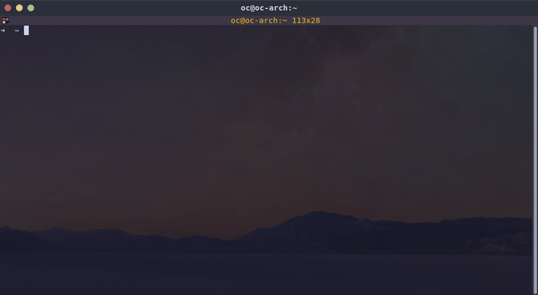
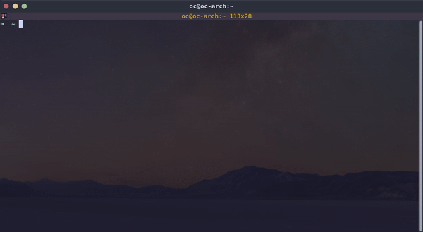
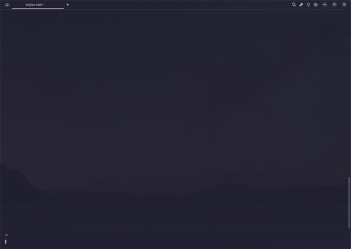

# DRACOON Commander RS

## What is this?
This is a port of [DRACOON Commander](https://github.com/unbekanntes-pferd/dccmd) - initially a Python3 project to use DRACOON via CLI.
The project serves as a demo client implementation using `dco3` - an API wrapper in Rust for DRACOON. 

### Built with
This project makes use of several awesome crates and uses async Rust throughout the project.
Crates used:
- [reqwest](https://crates.io/crates/reqwest)
- [clap](https://crates.io/crates/clap)
- [console](https://crates.io/crates/console)
- [dialoguer](https://crates.io/crates/dialoguer)
- [indicatif](https://crates.io/crates/indicatif)

Full dependency list: [Cargo.toml](Cargo.toml)

For all DRACOON operations `dco3` is used.

- [dco3](https://github.com/unbekanntes-pferd/dco3)

## Installation

You can download precompiled binaries on the Github releases page: 
[Releases](https://github.com/unbekanntes-pferd/dccmd-rs/releases)

If you have the Rust toolchain installed, you can install this using cargo like so:

```bash
cargo install dccmd-rs
```

If you like it even rougher or would like to contribute, feel free to compile from source:

Clone the repository and either use `cargo run` or build your own executable with `cargo build`:

```bash
git clone https://github.com/unbekanntes-pferd/dccmd-rs.git
cd dccmd-rs
cargo build
```

## What works?

Currently, the following commands are working:

- `config` - config management of DRACOON Commander (see subcommands below)
- `download` - downloads a file or folder / room from DRACOON to a desired location on disk (encrypted, unencrypted)
- `ls` - lists all nodes for a given path in DRACOON
- `mkdir` - creates a folder in given path in DRACOON
- `mkroom` - creates a room (inherits permissions) in given path in DRACOON
- `rm` - removes a node by given path in DRACOON
- `upload` - uploads a file or folder to a parent in DRACOON (encrypted, unencrypted)
- `users` - user management in DRACOON (see subcommands below)


## Example usage

For the sake of clarity, the usage of the binary is called `dccmd-rs`, regardless of the use via `cargo` or a compiled executable.

### Downloads



To download a file, use the download command:

```bash
dccmd-rs download your.dracoon.domain/some/room/some-file.pdf ./your/path/your-name.pdf
```

To download a container (room or folder), use the download command with recursive flag:

```bash
dccmd-rs download -r your.dracoon.domain/some/room ./your/path
```
**Note**: This will create a directory with same name as your container. Sub rooms are **not** included.

To download a list search result, use the download command with a search string:

```bash
dccmd-rs download your.dracoon.domain/some/*.pdf ./your/path
```

To download a file with **no** authorization to a public download share (share):

```bash
dccmd-rs download your.dracoon.domain/public/download-shares/someLongAccessKey /your/path
```

**Note**: This essentially means you need to copy the created share link

### Uploads



To upload a file, use the upload command:

```bash
dccmd-rs upload ./your/path/your-name.pdf your.dracoon.domain/some/room
```

**Note:** Currently, providing a custom name is not implemented.

You can share the file directly and create a share link (default settings) by passing the `--share` flag:

```bash
dccmd-rs upload ./your/path/your-name.pdf your.dracoon.domain/some/room --share
```

To upload a folder, use the `--recursive` flag:

```bash
dccmd-rs upload /your/path your.dracoon.domain/some/room
```
**Note:** Currently only absolute paths are supported for recursive uploads.

To upload a file with **no** authorization to a public upload share (file request):

```bash
dccmd-rs upload /your/path your.dracoon.domain/public/upload-shares/someLongAccessKey
```

**Note**: This essentially means you need to copy the created share link

#### Upload options

When uploading, the default resolution strategy is *autorename* - this means that if a file `foo.pdf` uploaded and already present, it is automatically renamed by DRACOON (e.g. to `foo (1).pdf`).

In order to change this behavior, you can the pass the following flags / options:
- *--overwrite* - a file with the same name will be overwritten (essentially creating versions of the same file)
- *--keep-share-links* - if *--overwrite* is used, you can additionally keep existing (download) share links for file(s)

 ### Transfers

 To transfer a file from DRACOON instance another instance, use the transfer command:

```bash
dccmd-rs transfer instance1.domain.com/some/file.pdf instance2.domain.com/some/target/path
```

### Transfer options
These options are analogue to the upload options (see above).

When uploading, the default resolution strategy is *autorename* - this means that if a file `foo.pdf` uploaded and already present, it is automatically renamed by DRACOON (e.g. to `foo (1).pdf`).

In order to change this behavior, you can the pass the following flags / options:
- *--overwrite* - a file with the same name will be overwritten (essentially creating versions of the same file)
- *--keep-share-links* - if *--overwrite* is used, you can additionally keep existing (download) share links for file(s)


### Listing nodes



To list nodes, use the `ls` command:

```bash
dccmd-rs ls your.dracoon.domain/some/path

// for root node use a trailing slash
dccmd-rs ls your.dracoon.domain/

// for searches within the room
dccmd-rs ls your.dracoon.domain/*.pdf 

// only files
dccmd-rs ls your.dracoon.domain/some/room --filter type:eq:file
```

Options:
 - `-l`, `--long` - prints all details (size, updated by, node id...)           
 - `-r`, `--human-readable` - prints size in human readable format
 -    `--managed` - shows room as room admin / room manager (rooms w/o permissions)       
 -    `--all` - fetches all items (default: first 500 items)
 - `--filter` - filter for specific values (see API docs for filter info)


### Deleting nodes

To delete nodes, use the `rm` command:

```bash
dccmd-rs rm your.dracoon.domain/some/path/some_file.pdf
dccmd-rs rm -r your.dracoon.domain/some/path/some/room
dccmd-rs rm -r your.dracoon.domain/*test
```
*Note*: If you intend to delete a container (room or folder), use the recursive flag.
*Note*: Room deletion always requires additional confirmation.
*Note*: You can delete the content in a room by using search strings (`*` deletes all). This does **not** include rooms.

### Creating folders

To create folders, use the `mkdir` command:

```bash
dccmd-rs mkdir your.dracoon.domain/some/path/newfolder
```

To create rooms, use the `mkroom` command:

```bash
dccmd-rs mkroom your.dracoon.domain/some/path/newroom
# pass optional usernames for admins (example adds admins with usernames foo1, foo2 and foo3)
dccmd-rs mkroom your.dracoon.domain/some/path/newroom -a foo1 -a foo2 -a foo3

# you can additionally inherit permissions using the --inherit-permissions flag 
dccmd-rs mkroom your.dracoon.domain/some/path/newroom -a foo1 --inherit-permissions

# you can also set the default classification (example sets to confidential)
dccmd-rs mkroom your.dracoon.domain/some/path/newroom --classification 3
```

### Managing users

To import users, you can use the `users import some.dracoon.domain.com` command:

```bash
# csv header must be 'first_name,last_name,email,login,oidc_id,mfa_enforced'
# the order of these fields does not matter
# login, oidc_id and mfa_enforced are optional but must be present as field
dccmd-rs users import your.dracoon.domain/ /path/to/users.csv
dccmd-rs users import your.dracoon.domain/ /path/to/users.csv --oidc-id 2 # import as OIDC users
```

To list users, you can use the `users ls some.dracoon.domain.com` command:

```bash
# optional flags: --all (lists all users, default: 500, paging) --csv (csv format)
# optional flags: --filter (see API docs for filter info)
dccmd-rs users ls your.dracoon.domain/
dccmd-rs users ls your.dracoon.domain/ --csv --all > userlist.csv
dccmd-rs users ls your.dracoon.domain/ --filter userName:cn:foo
```

To create users, you can use the `users create some.dracoon.domain.com` command:

```bash
# params: --first-name, --last-name, --email, --login, --oidc-id 
dccmd-rs users create your.dracoon.domain/ -f foo -l bar -e foo@bar.com # local user
dccmd-rs users create your.dracoon.domain/ -f foo -l bar -e foo@bar.com --oidc-id 2 # OIDC user
```

To delete users, you can use the `users some.dracoon.domain.com rm` command:

```bash
# supported: user id, user login / username
dccmd-rs users rm your.dracoon.domain/ --user-id 2
dccmd-rs users rm your.dracoon.domain/ --user-name foo # short: -u
```

To fetch specific user info, you can use the `users info some.dracoon.domain.com` command:

```bash
# supported: user id, user login / username
dccmd-rs users info your.dracoon.domain/ --user-id 2
dccmd-rs users info your.dracoon.domain/ --user-name foo # short: -u
```

#### Switch auth methods

You can switch the auth method for a specific subset (or all users) belonging to a current auth method.
In order to use it, you need to pass the following parameters:
- *current-method* - current auth method in DRACOON - valid options: basic (or local), openid (or oidc), active-directory (or ad)
- *new-method* - new auth method in DRACOON - valid options see above
- *current-oidc-id* - optional current OIDC config id - must be provided if current method is openid
- *new-oidc-id* - optional new OIDC config id - must be provided if new method is openid
- *current-ad-id* - optional current AD config id - must be provided if current method is active-directory
- *new-ad-id* - optional new AD config id - must be provided if new method is active-directory
- *filter* - optional user filter - see API docs for details (e.g. email:cn:somedomain.com)
- *login* - optional login transformation (e.g. email, username, firstname.lastname) default: email

```bash
# in order to identify AD or openid ids, use the config system-info command (see below)

# switch from basic auth (local) to openid if local user email contains somedomain.com
dccmd-rs users switch-auth --current-method basic --new-method openid --new-oidc-id 99 --filter email:cn:somedomain.com your.dracoon.domain/

# switch from openid with id 88 to openid with id 99 while setting the login as firstname.lastname (replaced by user values)
dccmd-rs users switch-auth --current-method openid --new-method openid --current-oidc-id 88 --new-oidc-id 99 --filter email:cn:somedomain.com your.dracoon.domain/ --login "firstname.lastname"
```

### Managing groups

To list groups, you can use the `groups ls some.dracoon.domain.com` command:

```bash
# optional flags: --all (lists all groups, default: 500, paging) --csv (csv format)
# optional flags: --filter (see API docs for filter info)
dccmd-rs groups ls your.dracoon.domain/
dccmd-rs groups ls your.dracoon.domain/ --csv --all > grouplist.csv
dccmd-rs groups ls your.dracoon.domain/ --filter name:eq:foo
```

To create groups, you can use the `groups create some.dracoon.domain.com` command:

```bash
# params: --name
dccmd-rs groups create your.dracoon.domain/ --name foo
```

To delete groups, you can use the `groups some.dracoon.domain.com rm` command:

```bash
# supported: group id, group name
dccmd-rs groups rm your.dracoon.domain/ --group-id 2
dccmd-rs groups rm your.dracoon.domain/ --group-name foo
```

### Group users

To list group users, you can use the `groups users ls some.dracoon.domain.com` command:

```bash
# get all group users for every group
dccmd-rs groups users ls your.dracoon.domain/

# list group users in csv format 
dccmd-rs groups users ls your.dracoon.domain/ --csv
dccmd-rs groups users ls your.dracoon.domain/ --csv --all > groupusers.csv

# get specific group users (for a group)
dccmd-rs groups users ls your.dracoon.domain/YourGroupName --csv --all
```

### Reports

To fetch reports (either table live view or CSV) of events or permissions, use the respective `reports` command:

#### Events (audit log)
**This command only works for DRACOON Server and is not supported for DRACOON Cloud!**
For DRACOON Cloud, please use the built-in reports.

```bash
# lists first 500 events of your domain
dccmd-rs reports events your.dracoon.domain/ 
# list all events of your domain (will *not* parallelize and might take a long time to conclude!)
dccmd-rs reports events your.dracoon.domain/ --all
# list events as CSV format
dccmd-rs reports events your.dracoon.domain/ --csv > events.csv # store in CSV

# provide optional start date or end date
dccmd-rs reports events your.dracoon.domain/ --start-date 2021-01-01
dccmd-rs reports events your.dracoon.domain/ --end-date 2024-01-01

# filter by event status (failure: 2, success: 0)
dccmd-rs reports events your.dracoon.domain/ --status 0 # all success operations

# filter by user id (only display events from user 99)
dccmd-rs reports events your.dracoon.domain/ --user-id 99

# list eventlog operations (needed for filtering by operation id)
dccmd-rs reports operation-types your.dracoon.domain/

# filter by operation id (type) 
dccmd-rs reports events your.dracoon.domain/ --operation-type 125
```

#### Permissions (node permissions)
**This command only works for DRACOON Server and is not supported for DRACOON Cloud!**
For DRACOON Cloud, please use the built-in reports.

```bash
# list all permissions of your domain (will *not* parallelize and might take a long time to conclude!)
# note: if you call this, in order to reduce load, first, all users are fetched and then all permissions generated per user
# there is no pagination in this, so you can ommit offset and limit
dccmd-rs reports permissions your.dracoon.domain/ 
# list permissions as CSV format
dccmd-rs reports permissions your.dracoon.domain/ --csv > events.csv # store in CSV

# list permissions for a specific user
dccmd-rs reports permissions your.dracoon.domain/ --filter userId:eq:99

# list permissions for a specific room
dccmd-rs reports permissions your.dracoon.domain/ --filter nodeId:eq:99
# for a full list of available filters, check the API documentation
```

### Config

#### Stored authorization

You can verify if the refresh stoken is (securely) stored via the `config auth ls` command.
In order to remove a stored token, use the `config auth rm` command.

```bash
# displays user info for stored refresh token
dccmd-rs config auth ls your.dracoon.domain/
# removes stored refresh token for given domain
dccmd-rs config auth rm your.dracoon.domain/ 
```

#### Stored crypto secret

You can verify if the crypto secret is (securely) stored via the `config crypto ls` command.
In order to remove a stored token, use the `config crypto rm` command.

```bash
# displays user info for stored crypto secret
dccmd-rs config crypto ls your.dracoon.domain/
# removes stored crypto secret for given domain
dccmd-rs config crypto rm your.dracoon.domain/ 
```

#### System info

You can fetch the system info (OpenID config, AD config, used users and storage) via the `config system-info` command.

```bash
# displays system information
# requires config manager role
dccmd-rs config system-info your.dracoon.domain/
```


### CLI mode

Currently dccmd-rs will fail to store credentials if you are running a headless Linux or are trying to run in Windows with WSL.
In such cases you can pass the username and password as arguments like so:

```bash
dccmd-rs --username your_username --password your_secure_password ls your.dracoon.domain/some/path
```

Use this at your own risk and be aware that the password is stored in plain in your shell history.
*Note*: This only works for the password flow - this means you **must** use a local user. 

This also works for the encryption password like so: 

```bash
dccmd-rs --username your_username --password your_secure_password --encryption-password your_secure_encryption_password ls your.dracoon.domain/some/path
```